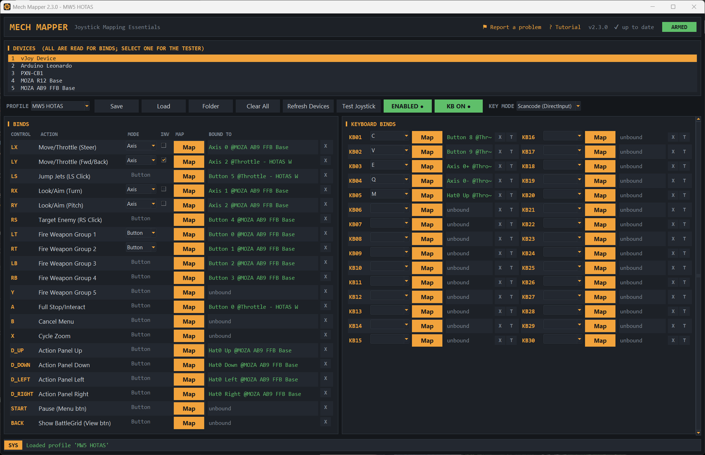
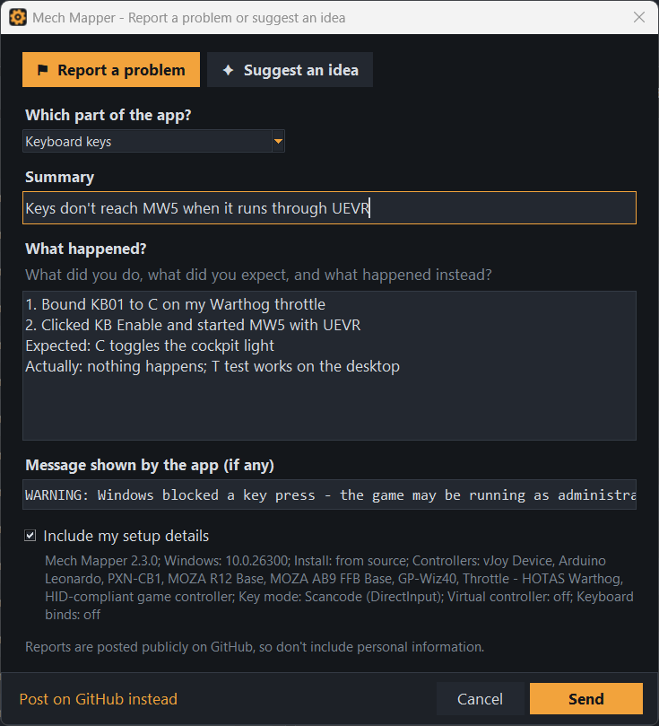

# Mech Mapper

A Windows desktop utility that maps any joystick, HOTAS, or gamepad input to a **virtual Xbox 360 controller** and/or **emulated keyboard presses**, with per-control axis/button modes, named profiles, and a built-in input tester. Built for games (like *MechWarrior 5*) that only recognize a standard Xbox controller, or that poll the keyboard per-frame in ways naive key-emulation libraries miss.

[](https://github.com/SFXShannon/MechMapper/releases) [](https://github.com/SFXShannon/MechMapper/releases/latest) [](LICENSE.txt) 



**New here?** Mech Mapper opens a quick tour the first time it starts, and the [step-by-step tutorial](docs/TUTORIAL.md) walks you through everything with pictures. See [Getting started](#getting-started).

## Download and install

1. Download **`MechMapper-Setup-<version>.exe`** from the [latest release](https://github.com/SFXShannon/MechMapper/releases/latest).
2. Run it. If Windows shows **"Windows protected your PC"**, click **More info**, then **Run anyway**. This appears because the installer isn't code-signed; it's the same for most free tools.
3. Click **Yes** when Windows asks for administrator rights, accept the license, and follow the steps. The installer also installs the virtual-controller driver (ViGEmBus) if it's missing.
4. Start **Mech Mapper** from the Start menu (or the desktop shortcut, if you chose one).
5. Follow the [tutorial](docs/TUTORIAL.md) to set up your first profile.

The app updates itself: when a new version is out it asks whether to install it. Uninstall it from **Settings > Apps** like any other program; your profiles (in `%APPDATA%\Mech Mapper\profiles`) are kept.

**Prefer no installer?** Download **`MW5_MECHMAPPER.exe`** instead, put it in its own folder and run it. That portable copy keeps its profiles in a `profiles` folder next to itself and also updates itself.

Mech Mapper needs administrator rights so its key presses reach games that run as administrator (for example with UEVR).

**Something not working?** See also the [troubleshooting table](docs/TUTORIAL.md#10-troubleshooting).
- *Game doesn't see the controller:* click **Enable** (it turns green). The game should then see an Xbox 360 controller.
- *Keyboard binds do nothing in the game:* click **KB Enable**, and try the other **Key Mode** if the game ignores one of them.
- *Antivirus deletes or blocks the exe:* some antivirus tools wrongly flag apps built with PyInstaller. Allow it in your antivirus, or run from source (see below).

## Getting started

### The quick tour

The first time you start Mech Mapper, a short tour pops up and walks you through the basics in eight steps: your devices, binding the Xbox controller, keyboard keys, arming it, profiles, reporting a problem, and updates. Use **Next** and **Back** (or the arrow keys).


- Tick **Don't show this at startup** to stop it opening every time.
- Click **? Tutorial** at the top of the window to open it again whenever you like.
- When a new version adds a step, that step is shown once after you update, even if the tour is turned off.

### The full tutorial

For the details, with screenshots, read the **[tutorial](docs/TUTORIAL.md)**:

1. [Install Mech Mapper](docs/TUTORIAL.md#1-install-mech-mapper)
2. [A tour of the window](docs/TUTORIAL.md#2-a-tour-of-the-window): every part of the window, numbered
3. [Check your devices with the tester](docs/TUTORIAL.md#3-check-your-devices-with-the-tester)
4. [Bind your stick to the virtual Xbox controller](docs/TUTORIAL.md#4-bind-your-stick-to-the-virtual-xbox-controller)
5. [Bind keyboard keys](docs/TUTORIAL.md#5-bind-keyboard-keys)
6. [Arm it and play](docs/TUTORIAL.md#6-arm-it-and-play)
7. [Save profiles](docs/TUTORIAL.md#7-save-profiles)
8. [Updates](docs/TUTORIAL.md#8-updates)
9. [Report a problem or suggest an idea](docs/TUTORIAL.md#9-report-a-problem-or-suggest-an-idea)
10. [Troubleshooting](docs/TUTORIAL.md#10-troubleshooting)

[](docs/TUTORIAL.md#2-a-tour-of-the-window)

## Feedback & bug reports



- **Found a bug?** Click **Report a problem** at the top of the app. Describe it and click **Send**: it goes straight to the developer as a [GitHub issue](https://github.com/SFXShannon/MechMapper/issues), with your app version, Windows version and controller names attached (untick the box to leave those out). **No GitHub account needed.**
- **Have an idea?** Use the same form and pick **Suggest an idea**, or post it under Ideas in [Discussions](https://github.com/SFXShannon/MechMapper/discussions/categories/ideas).
- **Prefer GitHub?** [Open a bug report](https://github.com/SFXShannon/MechMapper/issues/new?template=bug_report.yml) or [suggest a feature](https://github.com/SFXShannon/MechMapper/issues/new?template=feature_request.yml) directly (needs a free GitHub account).
- **Need help or have a question?** Ask in [Discussions](https://github.com/SFXShannon/MechMapper/discussions/categories/q-a).

Reports are public, so don't include personal information.

## Features

- **Multi-device input**: reads every connected joystick at once; bind controls from different devices in the same profile. Two identical sticks (same model, same GUID) are told apart.
- **Hot-plug**: devices are picked up and dropped automatically as you plug and unplug them. Bindings come back on their own when a device reconnects.
- **Virtual Xbox 360 output**: drives a ViGEm virtual pad (via `vgamepad`), so games see a real Xbox controller whatever hardware you use. Mech Mapper ignores its own virtual pad, so it can't map or read its own output.
- **Axis or Button mode**: each stick and trigger can be driven by its native axis, or by a pair of buttons acting as +/- (useful for HOTAS switches standing in for stick movement).
- **Axis inversion** for sticks (in either mode) and for triggers driven by an axis.
- **30 keyboard emulation slots**: bind any button, hat direction, or axis direction to a key. Keys are injected as hardware scancodes (`SendInput`) so DirectInput games pick them up, or as standard virtual keys if the game expects that instead. Includes the numpad and right-hand modifier keys.
- **Directional axis binds**: an axis bound to a key remembers which way you pushed it, so one throttle or twist axis can drive two keys (for example forward = `W`, back = `S`).
- **Hat diagonals**: a hat bound to *Up* also fires on Up-Left and Up-Right.
- **Minimum key-hold enforcement**: a fast tap is held for at least 65 ms so per-frame game polling can't miss it.
- **Bind conflict detection**: refuses to bind a physical input that's already in use elsewhere.
- **Named profiles**: saved as JSON in a `profiles` folder; the last-used profile loads on startup, and you're asked before unsaved changes are thrown away.
- **Input tester window**: live view of axes, hats, and buttons for the selected device.
- **Quick tour** at startup (with a "Don't show this at startup" box), and a **Tutorial** link to open it again.
- **Built-in updater**: installs new versions from GitHub Releases.
- **Report a problem** from inside the app, without a GitHub account.
- **Cockpit-styled UI**: dark theme with amber/green status indicators. A binding shows amber when its device isn't plugged in.

## Requirements

- Windows (uses `SendInput` for keyboard injection and ViGEm for the virtual pad)
- Python 3.8+
- The [ViGEmBus driver](https://github.com/nefarius/ViGEmBus/releases). The app offers to install the bundled copy (in `vendor/`) on first run if it's missing.
- Python packages from `requirements.txt` (`pygame`, `vgamepad`). `tkinter` ships with the standard Windows Python installer.

## Running from source

For developers, or if you'd rather not run the exe.


```bash
pip install -r requirements.txt
python MW5_MECHMAPPER.py
```

The app asks for administrator rights on launch and relaunches itself elevated. Admin rights are needed so key presses reach games that run as administrator (for example a game hooked by UEVR). If you decline the prompt you can still continue without them.

For development without the elevation prompt, set `MECHMAPPER_NO_ELEVATE=1`.

## Building the exe and installer

Run `build.bat` (it installs PyInstaller if needed). It builds:

- `dist\MW5_MECHMAPPER.exe`, the portable exe, with PyInstaller:

  ```bash
  pyinstaller --noconfirm --onefile --windowed --uac-admin ^
      --add-data "vendor;vendor" --collect-all vgamepad ^
      --icon mech_mapper.ico --add-data "mech_mapper.ico;." ^
      --add-data "LICENSE.txt;." --add-data "THIRD_PARTY_NOTICES.txt;." --add-data "mech_mapper.png;." ^
      MW5_MECHMAPPER.py
  ```
- `dist\MechMapper-Setup-<version>.exe`, the installer, with [Inno Setup 6](https://jrsoftware.org/isdl.php) from `installer.iss` (via `build_installer.ps1`). It's skipped if Inno Setup isn't installed. The installer shows the license, installs to Program Files, adds Start-menu (and optional desktop) shortcuts and an uninstaller, and installs ViGEmBus when it's missing. Keep the `AppId` in `installer.iss` unchanged so upgrades replace the existing install.

- `--uac-admin` makes Windows ask for admin rights when the exe starts.
- `--collect-all vgamepad` bundles `ViGEmClient.dll`, which PyInstaller misses on its own (without it the exe crashes on launch).
- `vendor/` carries the ViGEmBus installer, so a missing driver is installed on first run (after one admin prompt). The app then carries on without a restart where possible.
- `mech_mapper.ico` (16-256 px) is the app and exe icon; `mech_mapper.png` is a 256 px copy for the repo or release page. `build.bat` skips the icon if the file is missing.

If you update the bundled driver, replace the file in `vendor/` and update `VIGEM_INSTALLER` near the top of `MW5_MECHMAPPER.py` to match.

## Updates and releases

Mech Mapper checks GitHub for a newer release a few seconds after it starts, and you can check any time by clicking the version text in the top-right of the window. When a newer version exists you can install it now (it downloads the new version and verifies it, then an installed copy runs the new setup silently and a portable copy swaps its exe; either way it restarts), skip that version, or be reminded next time. Running from source, it offers to open the release page instead.

To publish a release:

1. Set `APP_VERSION` near the top of `MW5_MECHMAPPER.py` (for example `2.1.0`) and commit.
2. Tag and push: `git tag v2.1.0` then `git push origin v2.1.0`.
3. The **Release** GitHub Action builds the installer and the portable exe and attaches both to a new release. It refuses to build if the tag and `APP_VERSION` don't match.

The updater uses GitHub's public API, so **the repository must be public** for other people's copies to see releases. For a private repo, set a GitHub token in the `MECHMAPPER_GITHUB_TOKEN` environment variable on the PCs that should update. If an update can't replace the exe, the reason is written to `update.log` next to the exe.

## Usage

The [tutorial](docs/TUTORIAL.md) covers all of this with screenshots. In short:

1. **Devices**: every connected device is read for binds. Selecting one only chooses which device the input tester shows.
2. **Bind controls**: click **Map** next to a control, then move the axis or press the button you want. Press **Esc** (or the Cancel button) to stop waiting; mapping also gives up after 10 seconds. Sticks and triggers can be set to *Axis* or *Button* mode; in Button mode a stick gets separate `+`/`-` binds.
3. **Invert** an axis with the checkbox if it's backwards.
4. **Keyboard binds**: pick a key for a slot, then click **Map** and press a button, push a hat, or move an axis in the direction that should trigger it. Use **T** to test-fire the slot's key after a 3-second countdown, without involving the joystick.
5. **Key Mode**: *Scancode* (DirectInput, works with most games) or *Virtual Key* (standard Windows key events).
6. **Enable** arms the virtual Xbox 360 controller; **KB Enable** arms keyboard emulation. Either can run on its own.
7. **Profiles**: type a name and **Save**; pick one from the list to load it. **Folder** opens the profiles folder.
8. **Test Joystick** opens the live tester for the selected device.
9. **? Tutorial** opens the quick tour again; **Report a problem** sends a bug report or idea.

## Configuration storage

Profiles are stored as `profiles/<name>.json` next to the script or portable exe (or in `%APPDATA%\Mech Mapper\profiles` when installed with the setup program), and `profiles/.last_profile` remembers which one to load at startup. On first run, profiles from older versions are **copied** into this folder (originals are left in place) from:

- `.json` profiles saved next to the script or exe by the previous version
- `%USERPROFILE%\.mech_mapper_configs\`
- the very old single-file `%USERPROFILE%\.xbox360_mapper_pro.json` (becomes the `default` profile)

## Notes

- Analog stick deadzone is `0.08`, rescaled so there's no jump at the edge of the deadzone.
- Two identical devices are numbered in the order Windows reports them. If they swap order after a reboot, swap their binds or rebind.
- Keyboard emulation is Windows-only.

## License

Copyright (c) 2026 SFXShannon. All rights reserved. Mech Mapper is **not open source**: you may download and use it free of charge for personal, non-commercial use, but not modify, redistribute or sell it. See [LICENSE.txt](LICENSE.txt). Third-party components keep their own licenses; see [THIRD_PARTY_NOTICES.txt](THIRD_PARTY_NOTICES.txt).
