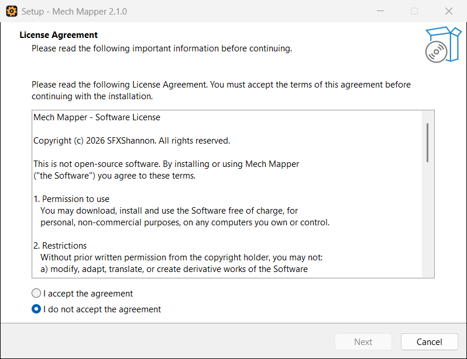
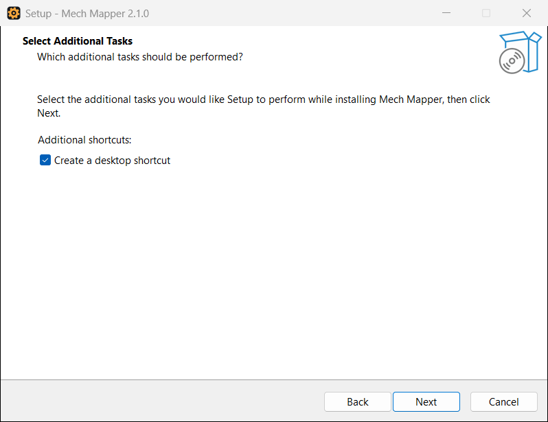
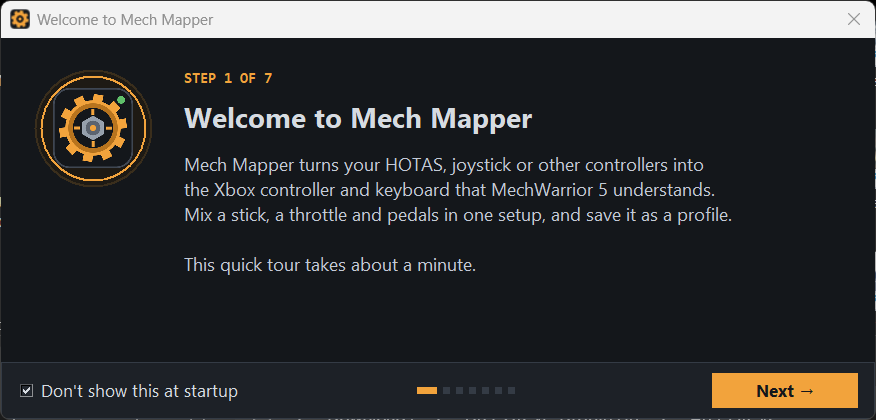
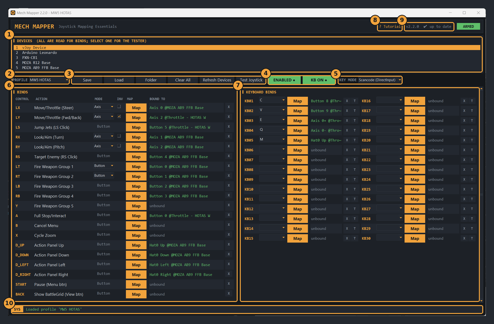
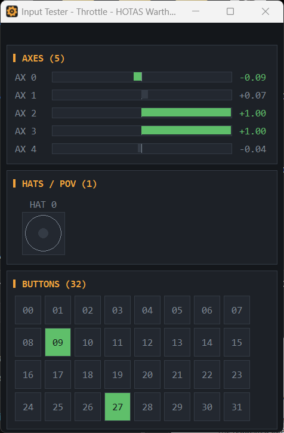
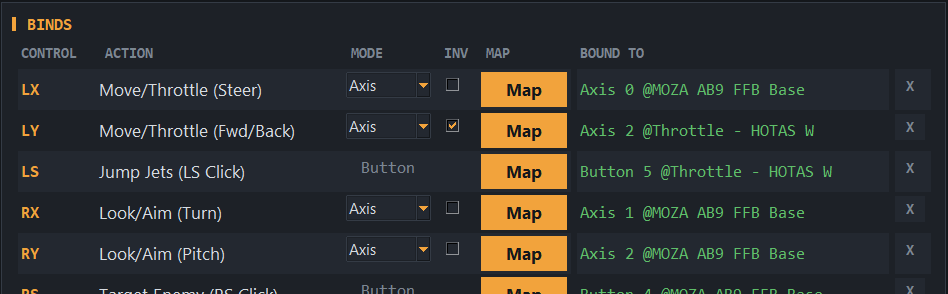
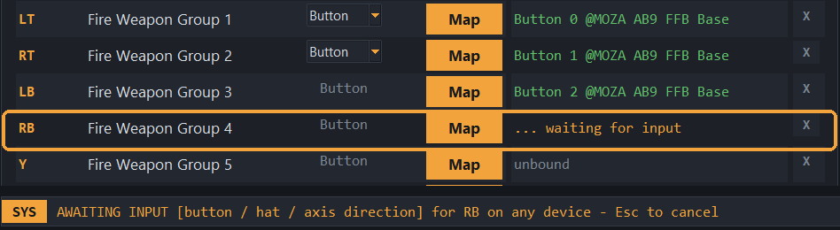
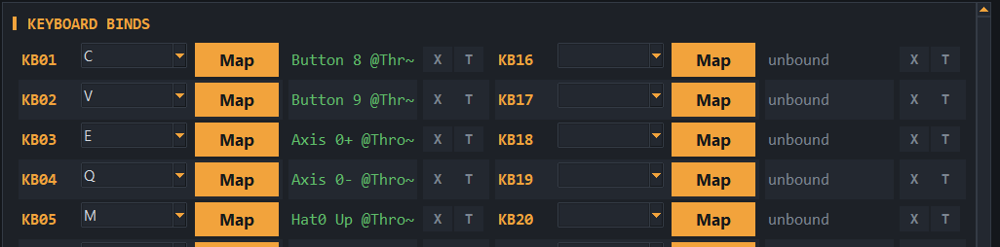
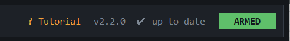

# Mech Mapper tutorial

This walks you from download to stomping around in MechWarrior 5 with your HOTAS or joystick. It takes about ten minutes.

**Contents**

1. [Install Mech Mapper](#1-install-mech-mapper)
2. [A tour of the window](#2-a-tour-of-the-window)
3. [Check your devices with the tester](#3-check-your-devices-with-the-tester)
4. [Bind your stick to the virtual Xbox controller](#4-bind-your-stick-to-the-virtual-xbox-controller)
5. [Bind keyboard keys](#5-bind-keyboard-keys)
6. [Arm it and play](#6-arm-it-and-play)
7. [Save profiles](#7-save-profiles)
8. [Updates](#8-updates)
9. [Troubleshooting](#9-troubleshooting)

---

## 1. Install Mech Mapper

1. Download **`MechMapper-Setup-<version>.exe`** from the [latest release](https://github.com/SFXShannon/MechMapper/releases/latest).
2. Run it. If Windows shows a blue **"Windows protected your PC"** screen, click **More info**, then **Run anyway**. (It appears because the installer isn't code-signed.)
3. Click **Yes** when Windows asks for administrator rights.
4. Read and accept the license, then click **Next**.

   

5. Choose whether you want a desktop shortcut, then click **Next** and **Install**.

   

The installer also installs **ViGEmBus**, the small driver that lets Mech Mapper create a virtual Xbox 360 controller, if your PC doesn't have it yet.

> **No installer?** You can download the portable **`MW5_MECHMAPPER.exe`** instead. Put it in its own folder and run it; if the driver is missing it offers to install it the first time.

---

## 2. A tour of the window

The first time you start Mech Mapper, a quick tour walks you through the basics. Tick **Don't show this at startup** if you don't want it every time; you can open it again whenever you like from **Tutorial** at the top of the window.

Here's the main window:

1. **Devices**: every controller Windows can see. Mech Mapper reads *all* of them at once, so you can mix a stick, a throttle and pedals in one profile. Selecting one only picks which device the tester shows. Devices are picked up automatically when you plug them in.
2. **Profile**: the name of the profile you're editing. Pick one from the list to load it.
3. **Save / Load / Folder / Clear All / Refresh Devices / Test Joystick**: profile and device tools.
4. **Enable** and **KB Enable**: switch the virtual Xbox controller and the keyboard keys on and off. They turn green while they're on.
5. **Key Mode**: how key presses are sent (see [section 5](#5-bind-keyboard-keys)).
6. **Binds**: the virtual Xbox controller. Each row is one Xbox stick, trigger or button. The *Action* column shows what that control does in MechWarrior 5's default controller layout.
7. **Keyboard Binds**: 30 slots that turn a button, hat direction or axis into a key press.
8. **? Tutorial**: opens the quick tour again.
9. **Version / updates**: click it to check for a new version.
10. **Status bar**: what just happened, and what Mech Mapper is waiting for.

Bindings show in **green** when their device is connected and **amber** when it's unplugged.

---

## 3. Check your devices with the tester

Before binding anything, make sure Windows sees your hardware the way you expect.

1. Click your device in the **Devices** list.
2. Click **Test Joystick**.
3. Move every axis and press every button. Bars fill as axes move, the dot moves with the hat, and buttons light up green.

Some HOTAS switches stay "on" (like the Warthog's flip switches, lit above). That's fine: Mech Mapper only reacts to a *change* when you bind something.

---

## 4. Bind your stick to the virtual Xbox controller

**To bind a control:**

1. Click **Map** on the row you want, for example **LX** (steer).
2. The row says **waiting for input**. Move the axis or press the button on your stick.
3. The row turns green and shows what you bound, like `Axis 0 @MOZA AB9 FFB Base`.

Press **Esc** (or **Cancel** in the status bar) to stop waiting. Mapping also gives up after 10 seconds.

**Axis or Button mode**

Sticks (LX, LY, RX, RY) and triggers (LT, RT) have a **Mode** box:

- **Axis**: driven by a real axis on your device. This is the normal choice.
- **Button**: driven by buttons instead. A stick in Button mode gets separate **+** and **-** buttons, so two buttons or hat directions can push it each way. A trigger in Button mode is fully pressed while its button is held.

**Invert**

Tick **INV** if an axis works backwards. In the picture above, the throttle drives **LY** inverted, so pushing the throttle forward walks the mech forward.

**Good to know**

- Hats work like a D-pad. A hat bound to **Up** also fires on Up-Left and Up-Right.
- Each physical input can only be bound once. If you try to reuse one, Mech Mapper tells you where it's already used; click **X** on that row first.
- **X** on any row clears it.

---

## 5. Bind keyboard keys

Some MechWarrior 5 actions (or VR mods) are easier to reach with a key. Keyboard slots turn any button, hat direction or axis movement into a key press.

1. Pick a key in a slot's drop-down, for example **C**.
2. Click **Map** and press the button (or push the hat, or move the axis) that should press it.
3. Click **T** to test: you get 3 seconds to click into the game, then Mech Mapper presses the key once.

**One axis, two keys.** An axis bound to a key remembers which way you moved it. In the picture, **KB03** is axis 0 pushed one way (**E**) and **KB04** is the same axis pushed the other way (**Q**).

**Key Mode**

- **Scancode (DirectInput)** works with most games, including MechWarrior 5. Start here.
- **Virtual Key (Standard)** is for programs that ignore scancodes. Switch to it only if keys don't register.

---

## 6. Arm it and play

1. Click **Enable**. Windows now sees a new **Xbox 360 Controller**, and the header lamp says **ARMED**.
2. Click **KB Enable** if you use keyboard slots.
3. Start MechWarrior 5 (or switch to it). The game reads the virtual Xbox controller like a real one.

Tips:

- Leave Mech Mapper running while you play; it works in the background. It doesn't need to be the active window.
- Only one copy of Mech Mapper runs at a time.
- Playing in VR with UEVR? Mech Mapper runs as administrator, so its key presses reach the game even when it's elevated.
- Click **Enable** again to switch the virtual controller off. Held keys are released automatically when you switch off or close the app.

---

## 7. Save profiles

1. Type a name in the **Profile** box (for example `MW5 HOTAS` or `Atlas - twist stick`).
2. Click **Save**.

The title bar shows `*` when you have unsaved changes, and Mech Mapper asks before throwing them away. The last profile you used loads automatically next time. **Folder** opens the folder where profiles are stored, so you can back them up or copy them to another PC.

---

## 8. Updates

A few seconds after it starts, Mech Mapper checks for a new version. When one is out it asks whether to install it now, skip that version, or remind you later. Installing downloads the update, checks it, and restarts Mech Mapper; your profiles are kept. Click the version label any time to check yourself.

---

## 9. Troubleshooting

| Problem | What to try |
|---|---|
| The game doesn't react to the controller | Make sure **Enable** is green. Check that your bindings are green, not amber (amber means the device is unplugged). |
| Keys don't register in the game | Make sure **KB Enable** is green, and try the **T** button to test the key on its own. If that doesn't work either, switch **Key Mode**. |
| "Windows blocked a key press" | The game is running as administrator but Mech Mapper isn't. Close Mech Mapper and start it again, clicking **Yes** at the admin prompt. |
| A device is missing from the list | Plug it in again; Mech Mapper picks it up automatically. If it still doesn't show, click **Refresh Devices**. |
| Two identical sticks swapped after a reboot | Windows sometimes numbers identical devices differently. Swap the bindings or map them again. |
| A binding says "already bound" | That input is used elsewhere. Click **X** on the row it names, then map again. |
| Antivirus blocks Mech Mapper | Some antivirus tools wrongly flag apps built with PyInstaller. Allow it in your antivirus. |
| The driver install failed | Download ViGEmBus from [its releases page](https://github.com/nefarius/ViGEmBus/releases), install it, then start Mech Mapper again. |

Still stuck? [Open an issue](https://github.com/SFXShannon/MechMapper/issues) and describe what you tried.
